<div align="center">
  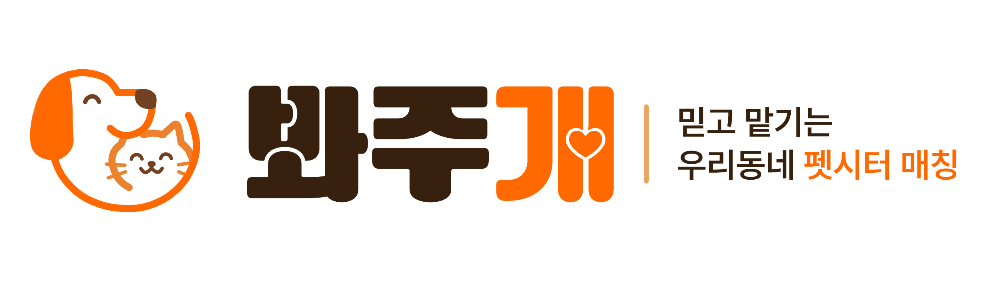
</div>
<p align="center">
  <strong>🗓️ 개발 기간</strong><br/>
  <span>2026.05.28 ~ 2026.07.08</span>
</p>
<br>
<div align="center">
  
  
  
  
  
  
</div>

## 📑 목차

- [프로젝트 소개](#-프로젝트-소개)
- [주요 기능](#-주요-기능)
- [기술 스택](#-기술-스택)
- [프로젝트 구조](#-프로젝트-구조)
- [시작하기](#-시작하기)
- [팀원](#-팀원)
- [문서](#-문서)

## 📝 프로젝트 소개

봐주개는 반려동물 보호자와 펫시터를 연결해주는 매칭 플랫폼입니다.
보호자는 원하는 조건의 펫시터를 찾아 예약하고, 펫시터는 프로필을 등록해 돌봄 서비스를 제공할 수 있습니다.

<p>
  <a href=".\docs\readme\멋쟁이사자처럼 파이널 - 봐주개(멍발자들)_v3.pdf">
    
  </a>
</p>

## ✨ 주요 기능

### 로그인 및 본인인증

<table>
  <tr>
    <td align="center">
      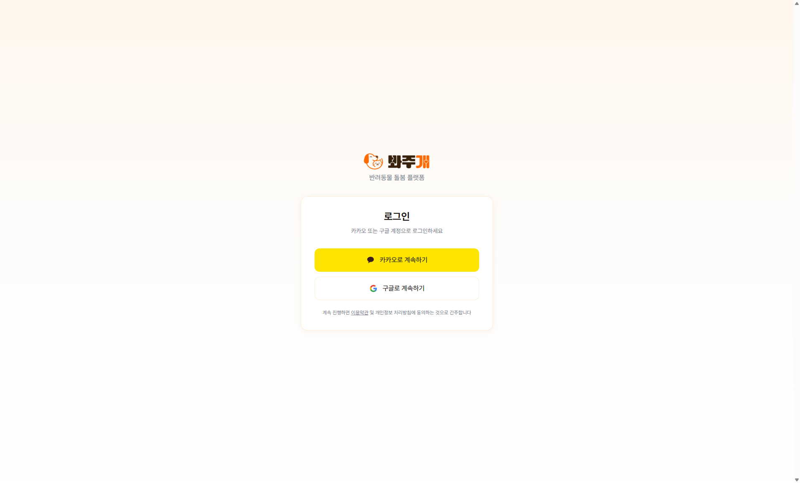<br/>
      <sub>로그인</sub>
    </td>
    <td align="center">
      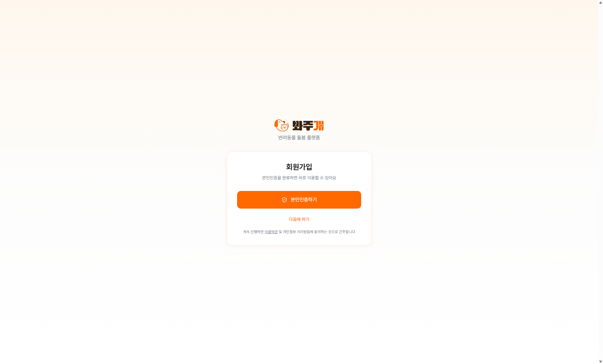<br/>
      <sub>본인인증</sub>
    </td>
  </tr>
</table>

### 반려동물 등록 및 관리

<table>
  <tr>
    <td align="center">
    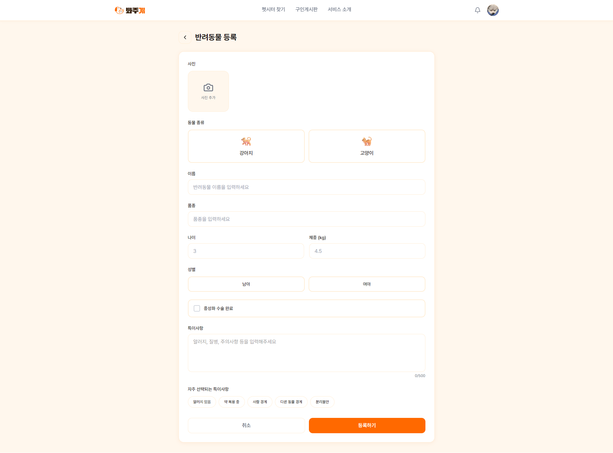<br/>
      <sub>반려동물 등록</sub>
    </td>
    <td align="center">
      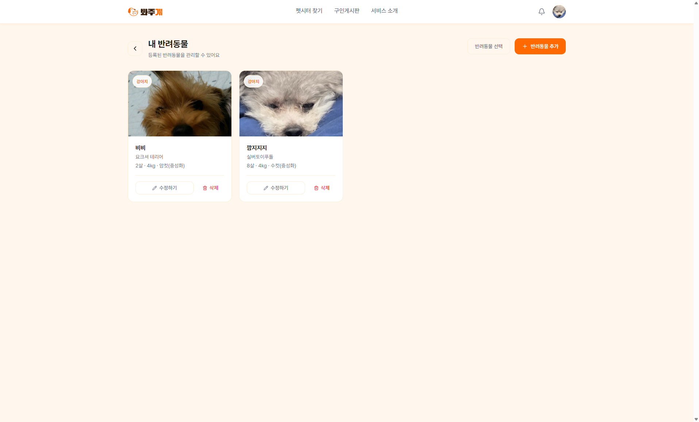<br/>
      <sub>반려동물 관리</sub>
    </td>
  </tr>
</table>

### 펫시터 등록

<table>
  <tr>
    <td align="center">
      <br/>
      <sub>펫시터 정보 입력</sub>
    </td>
    <td align="center">
      <br/>
      <sub>제공 서비스 선택</sub>
    </td>
  </tr>
  <tr>
  <td align="center">
      <br/>
      <sub>펫시터 자격증 업로드</sub>
    </td>
    <td align="center">
      <br/>
      <sub>펫시터 등록 완료 화면</sub>
    </td>
  </tr>
</table>

### 펫시터 검색 및 예약하기 시연

<video src=".\docs\readme\Pet_Sitter_Search_and_Reservation_Demo.mp4" controls width="600"></video>

### 실시간 채팅 시연 (예약요청, 예약 승인, 결제)

<video src=".\docs\readme\Real_Time_Chat_Demo.mp4" controls width="600"></video>

### 결제 (tosspayments 연동)

<table>
  <tr>
    <td align="center">
      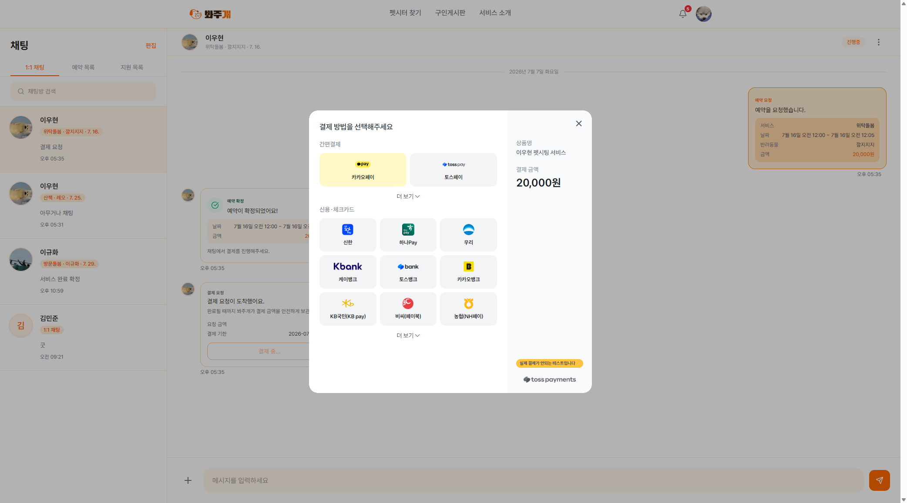<br/>
      <sub>결제</sub>
    </td>
  </tr>
  <tr>
</table>

### 후기 작성 및 조회

<table>
  <tr>
    <td align="center">
      <br/>
      <sub>펫시터 정보 입력</sub>
    </td>
  </tr>
  <tr>
  <td align="center">
      <br/>
      <sub>작성 후기 조회</sub>
    </td>

  <td align="center">
      <br/>
      <sub>받은 후기 조회</sub>
    </td>
  </tr>
</table>

### 알림

<table>
  <tr>
    <td align="center">
      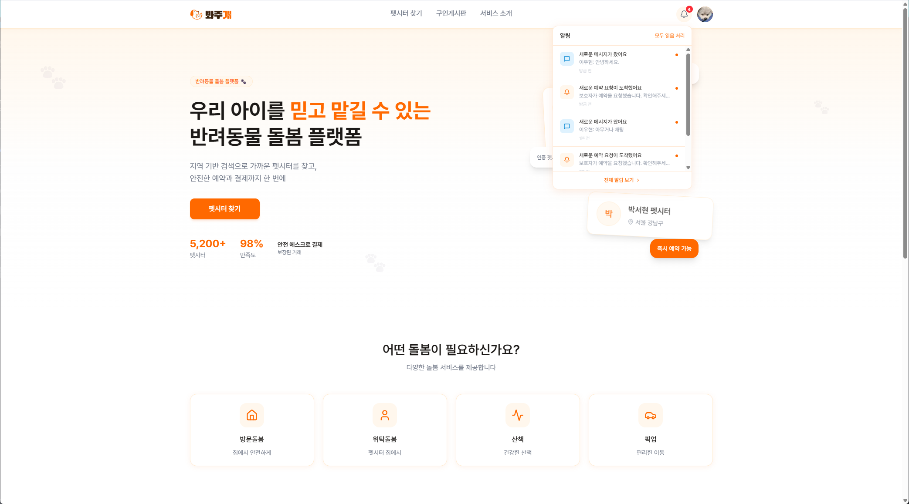<br/>
      <sub>알림 호버</sub>
    </td>
    <td align="center">
      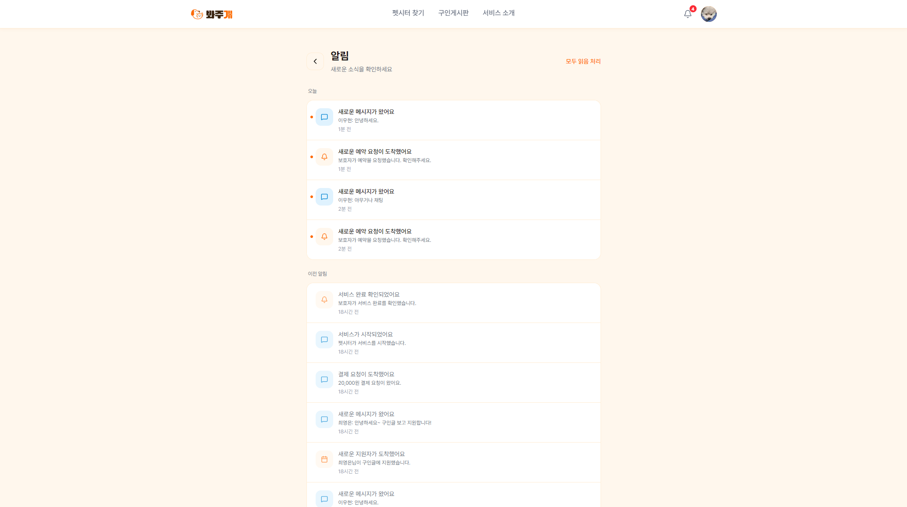<br/>
      <sub>알림</sub>
    </td>
  </tr>
</table>

### 게시판 글 작성 및 펫시터 지원 시연

<video src=".\docs\readme\Board_Post_Creation_Demo.mp4" controls width="600"></video>

### 정산(수익) 관리

<table>
  <tr>
    <td align="center">
      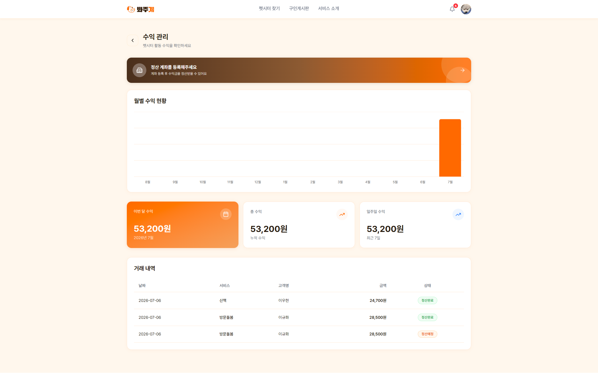<br/>
<sub>정산(수익) 관리</sub>
    </td>
  </tr>
  <tr>
</table>

### 관리자 페이지

<table>
  <tr>
    <td align="center">
      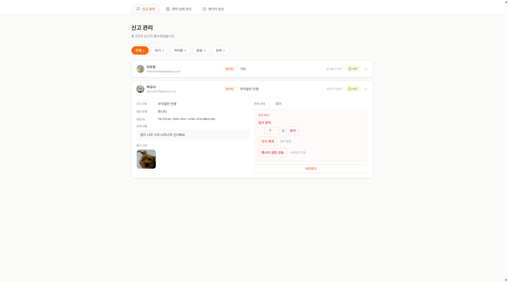<br/>
      <sub>신고 관리</sub>
    </td>
    <td align="center">
      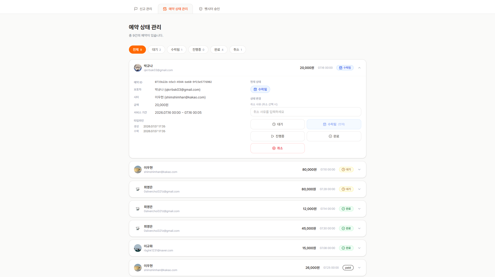<br/>
      <sub>예약 상태 관리</sub>
    </td>
  </tr>
  <tr>
    <td align="center">
      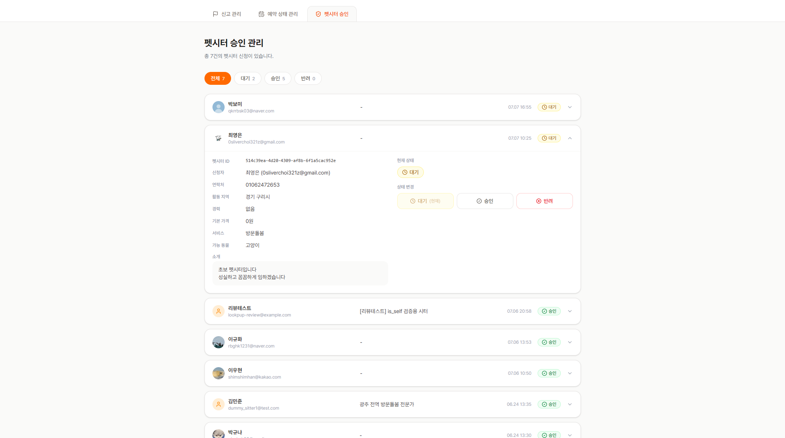<br/>
      <sub>펫시터 승인</sub>
    </td>
    <td></td>
  </tr>
</table>

## 🛠 기술 스택

| 구분               | 기술 스택                                     |
| ------------------ | --------------------------------------------- |
| **Framework**      | Next.js 16, React 19, TypeScript              |
| **Styling**        | Tailwind CSS, Radix UI, shadcn                |
| **State / Data**   | TanStack Query, Zustand, React Hook Form, Zod |
| **Backend / DB**   | Supabase                                      |
| **Authentication** | Supabase Auth, PortOne 본인인증               |
| **Payment**        | Toss Payments                                 |
| **Etc**            | Recharts, date-fns                            |

## 📚 주요 라이브러리

| 라이브러리                       | 버전            | 용도                              |
| -------------------------------- | --------------- | --------------------------------- |
| next                             | 16.2.6          | React 프레임워크, 라우팅/렌더링   |
| react / react-dom                | 19.2.4          | UI 렌더링                         |
| typescript                       | ^5              | 정적 타입 검사                    |
| tailwindcss                      | ^4              | 스타일링                          |
| @tailwindcss/postcss             | ^4              | Tailwind CSS PostCSS 플러그인     |
| tw-animate-css                   | ^1.4.0          | Tailwind 애니메이션 유틸리티      |
| radix-ui / @radix-ui/react-icons | ^1.4.3 / ^1.3.2 | 헤드리스 UI 컴포넌트, 아이콘      |
| shadcn                           | ^4.9.0          | Radix 기반 UI 컴포넌트 세트       |
| class-variance-authority         | ^0.7.1          | 컴포넌트 variant 스타일 관리      |
| clsx / tailwind-merge            | ^2.1.1 / ^3.6.0 | 클래스명 조건부 결합 및 중복 제거 |
| lucide-react                     | ^1.18.0         | 아이콘                            |
| @supabase/supabase-js            | ^2.107.0        | Supabase 클라이언트(DB, Auth)     |
| @supabase/ssr                    | ^0.10.3         | SSR 환경 Supabase 세션 처리       |
| @tanstack/react-query            | ^5.101.0        | 서버 상태 관리 및 데이터 패칭     |
| zustand                          | ^5.0.14         | 클라이언트 전역 상태 관리         |
| react-hook-form                  | ^7.77.0         | 폼 상태 관리                      |
| @hookform/resolvers              | ^5.4.0          | react-hook-form과 zod 스키마 연동 |
| zod                              | ^4.4.3          | 스키마 기반 유효성 검증           |
| react-day-picker                 | ^9.14.0         | 날짜 선택 UI (예약 일정 등)       |
| date-fns                         | ^4.4.0          | 날짜 포맷/연산                    |
| @portone/browser-sdk             | ^0.1.8          | 결제(PortOne) 연동                |
| recharts                         | ^3.8.0          | 정산/통계 차트                    |
| sonner                           | ^2.0.7          | 토스트 알림 UI                    |
| eslint / eslint-config-next      | ^9 / 16.2.6     | 코드 린팅                         |

## 📂 프로젝트 구조

<details>
<summary>펼쳐보기</summary>

```
lookpup/
├── src/
│   ├── app/
│   │   ├── about/                # 서비스 소개 페이지
│   │   ├── actions/               # 서버 액션
│   │   ├── admin/                 # 관리자 페이지 (신고, 상태 관리)
│   │   │   ├── reports/
│   │   │   └── state/
│   │   ├── api/                   # API 라우트
│   │   │   ├── chat/
│   │   │   ├── earnings/          # 정산
│   │   │   ├── notifications/
│   │   │   ├── pets/
│   │   │   ├── portone/           # 결제 웹훅/검증
│   │   │   ├── requests/          # 예약 요청
│   │   │   ├── reservations/
│   │   │   ├── reviews/
│   │   │   ├── sitters/
│   │   │   └── users/
│   │   ├── auth/                  # 인증
│   │   │   ├── callback/
│   │   │   ├── login/
│   │   │   ├── restore/
│   │   │   └── verification/
│   │   ├── board/                 # 게시판
│   │   │   ├── [id]/
│   │   │   └── write/
│   │   ├── chat/                  # 채팅
│   │   ├── myprofile/             # 마이페이지
│   │   │   ├── booking-history/
│   │   │   ├── earnings/
│   │   │   ├── mypets/
│   │   │   ├── posts/
│   │   │   ├── report/
│   │   │   ├── reviews/
│   │   │   ├── settings/
│   │   │   ├── sitter-edit/
│   │   │   └── sitter-profile/
│   │   ├── notifications/
│   │   ├── payment/               # 결제
│   │   │   └── complete/
│   │   ├── pet-register/          # 반려동물 등록
│   │   ├── petsitters/            # 펫시터 목록/상세
│   │   │   └── [id]/
│   │   ├── sitter-register/       # 펫시터 등록
│   │   ├── privacy/               # 개인정보처리방침
│   │   ├── terms/                 # 이용약관
│   │   ├── suspended/             # 정지 계정 안내
│   │   ├── layout.tsx
│   │   └── page.tsx
│   ├── components/                # 도메인/공통 UI 컴포넌트
│   │   ├── about/
│   │   ├── admin/
│   │   ├── board/
│   │   ├── chat/
│   │   ├── common/                # 공통 컴포넌트 (chat 등)
│   │   ├── home/
│   │   ├── layout/                # 헤더/푸터 등 레이아웃
│   │   ├── legal/
│   │   ├── myprofile/
│   │   ├── notifications/
│   │   ├── pet-register/
│   │   ├── petsitters/
│   │   ├── providers/             # Context/Query Provider
│   │   ├── sitter/
│   │   ├── sitter-register/
│   │   └── ui/                    # shadcn 기반 공통 UI
│   ├── hooks/                     # 커스텀 훅
│   │   ├── chat/
│   │   ├── pet-register/
│   │   ├── petsitters/
│   │   ├── sitter-register/
│   │   ├── queries/                # TanStack Query 훅 (펫시터/예약 등 조회)
│   │   ├── useAddressSearch.ts
│   │   ├── useAuth.ts
│   │   ├── useImageUpload.ts
│   │   └── usePortOne.ts
│   ├── lib/                       # 도메인 로직/헬퍼
│   │   ├── board.ts
│   │   ├── chatMessagePrefixes.ts
│   │   ├── notificationHelpers.ts
│   │   ├── notificationPrefs.ts
│   │   ├── sitterRegister.ts
│   │   ├── supabase.ts
│   │   └── utils.ts
│   ├── schemas/                   # zod 유효성 검증 스키마
│   │   ├── booking.schema.ts
│   │   ├── petRegister.ts
│   │   └── sitterRegister.ts
│   ├── store/                     # zustand 전역 상태
│   │   ├── bookingStore.ts
│   │   └── userStore.ts
│   ├── types/                     # 타입 정의 (Supabase 타입 포함)
│   │   ├── board.ts
│   │   ├── database.types.ts
│   │   ├── petRegister.ts
│   │   └── sitterRegister.ts
│   └── utils/                     # 유틸 함수
│       ├── boardConditions.ts
│       ├── cloudinary.ts
│       ├── distance.ts
│       ├── geoPrivacy.ts
│       ├── kakaoGeocode.ts
│       ├── mapMarker.ts
│       ├── petsitterArea.ts
│       └── supabase/               # Supabase 클라이언트/서버/미들웨어
│           ├── client.ts
│           ├── middleware.ts
│           ├── server.ts
│           └── service.ts
├── supabase/                       # Supabase 설정 및 마이그레이션
├── docs/                           # 프로젝트 문서 (API 명세 등)
└── public/                         # 정적 리소스 (로고, 이미지 등)
```

</details>

## 🏁 설치 및 실행

```bash
# 1. 저장소 클론
git clone https://github.com/FRONTENDBOOTCAMP-17th/lookpup.git

# 2. 폴더 이동
cd lookpup

# 3. 의존성 설치
npm install

# 4. 개발 서버 실행
npm run dev
```

## 🔑 환경 변수

프로젝트 루트에 `.env` 파일을 생성하고 아래 항목을 채워주세요.

```env
# Supabase
NEXT_PUBLIC_SUPABASE_URL=
NEXT_PUBLIC_SUPABASE_ANON_KEY=
SUPABASE_SERVICE_ROLE_KEY=

# PortOne (결제)
NEXT_PUBLIC_PORTONE_STORE_ID=
NEXT_PUBLIC_PORTONE_IDENTITY_CHANNEL_KEY=
NEXT_PUBLIC_PORTONE_IDENTITY_CHANNEL_KEY_TOSS=
PORTONE_API_SECRET=
PORTONE_WEBHOOK_SECRET=

# Cloudinary (이미지 업로드)
NEXT_PUBLIC_CLOUDINARY_CLOUD_NAME=
CLOUDINARY_API_KEY=
CLOUDINARY_API_SECRET=

# Kakao Map
NEXT_PUBLIC_KAKAO_MAP_KEY=

# 사이트 URL
NEXT_PUBLIC_SITE_URL=
```

## 👥 팀원

| 이름   | 역할 | GitHub           |
| ------ | ---- | ---------------- |
| 이규화 | 팀장 | @gyuhwa9922      |
| 박규나 | 팀원 | @Gyu-me          |
| 이우현 | 팀원 | @sealheal        |
| 최영은 | 팀원 | @0sliverchoi321z |

### 💬 소감

<details>
<summary>이규화</summary>
부족한 팀장이였지만
감사했습니다.
</details><br>

<details>
<summary>박규나</summary>
기획 단계에서 미처 놓쳤던 부분들을 개발 과정에서 발견하게 되면서, 기획 단계의 중요성을 다시 한 번 느꼈습니다. 프로젝트를 마무리하며 부족했던 부분도 많이 느꼈지만, 그만큼 이후에는 추가적인 리팩토링을 통해 프로젝트를 개선하고 다시 회고해보고 싶다는 생각이 들었습니다. 프로젝트 기간 동안 팀장님과 팀원분들께 많은 것을 배울 수 있었습니다. 마지막 프로젝트까지 모두 정말 고생 많으셨습니다.
</details><br>

<details>
<summary>이우현</summary>
프로젝트를 하면서 React에 왜 Next.js를 사용하는지 라우팅과 SSR의 필요성에 대해서도 잘 이해하게 되었습니다. 모르는 게 많았지만, 팀원들 덕분에 하나의 서비스를 제공하는 데에는 정말 많은 부분에 대한 이해가 필요하다는 사실도 알게 되었습니다. 프로젝트를 진행하는 동안 고생해주셔서 감사합니다.
</details><br>

<details>
<summary>최영은</summary>
새로운 스택과 함께하니 바닐라 프로젝트와는 또 다른 느낌으로 임할 수 있어 좋았습니다. 강의 중 React나 Next.js를 배웠던 것보다도 심화 과정인 실전에 투입되었지만, 팀원들과의 논의와 멘토링, 코드 리뷰 피드백을 되짚어가며 부족한 부분을 채워나갈 수 있었습니다. Supabase도 처음엔 낯설었지만 이번 프로젝트를 계기로 친해질 수 있었던 것 같습니다. 개발 중에서는 실시간 메시지 수신 과정에서 겪은 문제가 가장 어려웠던 듯 합니다. 가령 같은 메시지가 소켓으로 중복 수신되면서 React key 충돌이 나는 문제가 생겨 머리를 부여잡았던 기억이 있는데, 단순히 key 값을 바꾼다고 끝나는 것이 아니라 "왜 같은 메시지가 두 번 들어오는가"부터 추적하고 결국에는 수신 로직 자체에 중복 방지를 넣어야 했습니다. 이런저런 시도가 많았지만 다시 한번 이번 작업물을 작업할 수 있는 기회가 있었으면 좋겠습니다. 마지막까지 다들 수고 많으셨고, 감사합니다.
</details><br>

## 📄 문서

프로젝트 진행 중 작성한 API 명세와 일자별 개발 리포트는 [`docs`](./docs) 폴더에서 확인할 수 있습니다.

- [API 명세서](./docs/API_SPEC_FINAL.md)
- [API 사용 가이드](./docs/API_USAGE.md)

<details>
<summary>일자별 개발 리포트 (펼쳐보기)</summary>

- [2026-06-08](./docs/REPORT_2026-06-08.md)
- [2026-06-09](./docs/REPORT_2026-06-09.md)
- [2026-06-10](./docs/REPORT_2026-06-10.md)
- [2026-06-11](./docs/REPORT_2026-06-11.md)
- [2026-06-14](./docs/REPORT_2026-06-14.md)
- [2026-06-15](./docs/REPORT_2026-06-15.md)
- [2026-06-16](./docs/REPORT_2026-06-16.md)
- [2026-06-17](./docs/REPORT_2026-06-17.md)
- [2026-06-18](./docs/REPORT_2026-06-18.md)
- [2026-06-19](./docs/REPORT_2026-06-19.md)
- [2026-06-22](./docs/REPORT_2026-06-22.md)
- [2026-06-23](./docs/REPORT_2026-06-23.md)
- [2026-06-24](./docs/REPORT_2026-06-24.md)
- [2026-06-25](./docs/REPORT_2026-06-25.md)
- [2026-06-28](./docs/REPORT_2026-06-28.md)
- [2026-06-29](./docs/REPORT_2026-06-29.md)
- [2026-06-30](./docs/REPORT_2026-06-30.md)
- [2026-07-01](./docs/REPORT_2026-07-01.md)
- [2026-07-02](./docs/REPORT_2026-07-02.md)
- [2026-07-05](./docs/REPORT_2026-07-05.md)
- [2026-07-06](./docs/REPORT_2026-07-06.md)

</details>

## 📜 라이선스

이 프로젝트는 [MIT License](./LICENSE.md)를 따릅니다.
